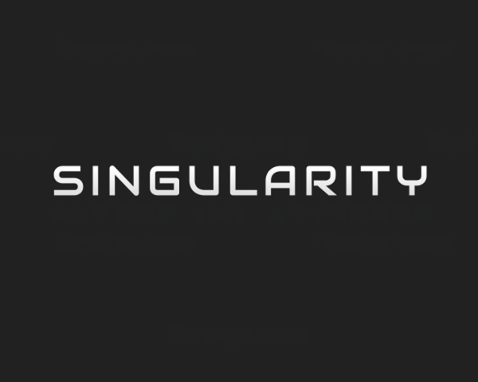

# Singularity



Singularity is a malware analysis and reverse‑engineering tool written in Rust. It provides a fast GUI and a CLI to analyze binaries, JavaScript/Node.js packages, and obfuscated Python payloads, with content extraction, disassembly, and secret detection.

## Overview
- **Dual GUI/CLI**: eframe/egui interface and command‑line analysis.
- **Multi‑format analysis**: PE/ELF, scripts, archives, and containers.
- **Extraction and deobfuscation**: PyInstaller, PyArmor, obfuscated JS, embedded files.
- **Advanced detection**: YARA (Boreal), secrets, URLs, heuristics, and layered analysis.
- **Built‑in tools**: decoders, steganography, online scanner, webhook report.

## Architecture (high‑level)
- **Entry point**: `src/main.rs` selects CLI mode if a path is provided, otherwise starts the GUI.
- **Interface**: `src/app.rs` manages state, tabs, the code viewer, report sending, and YARA consent.
- **Analysis engine**: `src/analysis.rs` orchestrates type detection, analyzer selection, and result aggregation.
- **Layered analysis**: `src/layered_analysis.rs` builds a layered report with investigation guidance.
- **YARA**: `src/signature_engine.rs` + `src/update_rules.rs` load and update rules (yara‑forge).
- **External tools**: `src/tools_manager.rs` installs Node.js, Synchrony/deobfuscator and asar via npm, and PyArmor OneShot.
- **Services**: `src/online_scanner.rs` integrates OPSWAT MetaDefender Cloud.
- **Malware modules**: `src/malware/*` and `src/heuristic_decryptor.rs` handle deobfuscation and config extraction.

## Analysis flow (summary)
1. **Type detection** (format, language, container heuristics).
2. **Analyzer selection** (PyArmor, PyInstaller, PYC, binary, text, Lua, unknown).
3. **Content extraction** (internal archives, snapshots, sections, strings).
4. **Deobfuscation** (Synchrony for JS, PyArmor OneShot, malware‑specific routines).
5. **Disassembly** and **imports/sections collection**.
6. **YARA detection** if rules are installed.
7. **Secrets/URLs scan** on outputs.
8. **Layered report** with follow‑up guidance.

## Detailed features

### 🔍 Advanced static analysis
- **Binary**: parsing via Goblin, sections, imports, strings.
- **Disassembly**: Capstone with readable listing.
- **Secrets & URLs**: regex + heuristics (Base64, reversed tokens).
- **YARA**: byte scanning and automatic rule loading.

### 📦 JavaScript / Node.js
- **ASAR**: extraction of Electron archives.
- **PKG snapshot**: reconstruction and listing of JS files.
- **Deobfuscation**: Synchrony/deobfuscator via npm.
- **Sandbox**: isolated execution via Boa.
- **Viewer**: display of original/deobfuscated code with search.

### 🧪 Python & stealer
- **PyInstaller**: TOC extraction, PYC reconstruction, and disassembly.
- **PyArmor OneShot**: automated extraction support.
- **Heuristic decryption**: keys/IVs detected in code/disassembly.
- **Stealer modules**: deobfuscation and configuration extraction.

### 🧰 Complementary tools
- **String decoder**: Base64, Hex, Rot13, Reverse, URL, Binary.
- **Steganography**: LSB, metadata, and Aperi'Solve integration.
- **Link decryptor**: manual mode in the viewer.
- **Report**: webhook sending with embeds and optional deletion.

### ☁️ Online scanner
- **MetaDefender Cloud (OPSWAT)**: 30+ AV engines via API.
- **Optimization**: hash resolution attempt before upload.

## GUI interface (tabs)
- **Info**: format, language, score, and metadata.
- **URLs**: centralized extraction.
- **Imports / Sections**: binary view.
- **Strings / Disassembly**: integrated text search.
- **Secrets**: detected tokens and keys.
- **Extracted**: files, original/deobfuscated code, JS sandbox.
- **Layered Analysis**: multi‑layer report and guide.
- **Send Report**: webhook + embeds + image.
- **Online Scan**: MetaDefender Cloud.

## Local storage
- **Tools**: `%APPDATA%\Singularity\tools` (Windows).
- **Extracts**: `%APPDATA%\Singularity\extracted`.
- **YARA rules**: `%APPDATA%\Singularity\signatures`.
- **Config**: `%APPDATA%\Singularity\config.json`.
- **Fallback**: if APPDATA/LOCALAPPDATA is unavailable, the temp directory is used.

## Installation

### Prerequisites
- Rust (latest stable)
- System dependencies for `eframe`/`wgpu` (typically installed by default on Windows/macOS, `libgtk-3-dev` etc. on Linux).

### Build
```bash
git clone https://github.com/your-username/singularity.git
cd singularity
cargo run --release
```

### External tools installation
On first launch, Singularity can automatically install:
- Node.js (portable) for Synchrony/deobfuscator and asar.
- PyArmor OneShot and its dependencies.
- YARA rules via yara‑forge (with explicit consent).

## Usage

### GUI mode
```bash
cargo run --release
```
Drag and drop a file into the window or use the menu to open a file to analyze.

### CLI mode
```bash
cargo run --release -- <path_to_file>
```
The CLI shows progress tracking, basic results, and the layered report.

## Technologies
- **Language**: Rust 🦀
- **GUI**: eframe / egui
- **Binary parsing**: Goblin
- **Disassembly**: Capstone
- **JS engine**: Boa
- **Signature matching**: Boreal (YARA)
- **HTTP**: reqwest

## Disclaimer
This tool is intended for educational and security research purposes. Malware analysis must be performed in an isolated and secure environment (virtual machine, sandbox). The author is not responsible for misuse of this tool.
